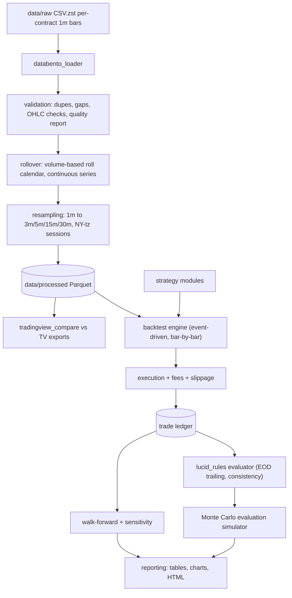

# Phase 1 Plan: MNQ Lucid Flex Evaluation Research

Date: 2026-07-06
Status: Awaiting approval before Phase 2

---

## 1. Repository state

The workspace `/Users/ethannguyen/Desktop/MNQ Strategy` contains a single file, `PROJECT_SPEC.md`, and nothing else. There is no git repository, no Python project, no config, no data, and no tests.

Note: `PROJECT_SPEC.md` is 0 bytes on disk; its content exists only in the unsaved editor buffer. Save the file before Phase 2 so the spec is not lost.

## 2. Data inspection results (completed 2026-07-06)

The Databento batch export lives at `/Users/ethannguyen/Desktop/GLBX-20260630-99GU63VXQL/` (58 MB `glbx-mdp3-20190529-20260628.ohlcv-1m.csv.zst` plus `metadata.json`, `manifest.json`, `condition.json`). It was fully decompressed and inspected read-only.

**Schema and format** (from `metadata.json` + file header):

- Dataset GLBX.MDP3, schema `ohlcv-1m`, symbols `MNQ.FUT` (parent, `stype_in: parent`), CSV + zstd, `pretty_px` and `pretty_ts` on (human-readable ISO timestamps and decimal prices), `map_symbols` on (raw contract symbol in each row)
- Columns: `ts_event, rtype, publisher_id, instrument_id, open, high, low, close, volume, symbol`
- Timestamps: UTC ISO-8601 nanoseconds, **bar-open** convention. Prices are decimals, all tick-aligned (0 rows off the 0.25 grid). Data is **raw and unadjusted** — no continuous stitching; we build our own.

**Coverage**: 3,798,888 rows total = 3,736,515 outright bars + 62,373 calendar-spread bars (symbols like `MNQH0-MNQM0` — these must be filtered out in the loader). Range 2019-05-29 00:00 UTC to 2026-06-28 23:59 UTC. 33 outright contracts, MNQM9 through MNQM7, full quarterly H/M/U/Z chain — about 7.1 years, exceeding the 3–5 year requirement. 1,832 trading days on the lead contract.

**Quality checks (all passed)**:

- Duplicate `(ts_event, symbol)` rows: 0
- OHLC relationship violations: 0
- Zero/negative prices or volumes: 0
- Non-tick-aligned prices: 0
- Typical lead-contract day has 1,380 one-minute bars (23h Globex session); median day is complete. 73 days have <1,200 minutes — inspection shows these are legitimate: holidays/half-days (Jul 4, Thanksgiving, Christmas Eve), COVID limit-halt days (2020-03-09/16/17/18), and the export boundary day 2026-06-29.
- `condition.json`: 2,212 days "available", 13 "degraded" (notably 2020-02-27/28, 2020-06-30/07-01, 2025-11-28), 13 "missing" — but all 13 "missing" dates are Saturdays (market closed), so no real data loss. Degraded days will be flagged in the data-quality report and excluded from strategy fitting if bar counts look off.

**Rollover behavior**: volume-lead analysis produces a clean quarterly roll calendar — 29 rolls, always ~4–7 days before third-Friday expiry (e.g., 2024-03-11 H4→M4, 2025-06-16 M5→U5, 2026-06-15 M6→U6), matching TradingView's volume-based MNQ1! convention closely. Roll gaps average **+119 points** (median +116, max +300, min −14) — large enough that back-adjustment is mandatory for indicators, confirming the dual-series design in Section 4.2.

Remaining data work for Phase 2 M0 is therefore reduced to: copy/reference the export under `data/raw/`, codify these checks into `scripts/inspect_data.py` + `validation.py`, and generate the formal data-quality report.

## 3. Lucid Flex rules (source and gaps)

Source: user-provided figures from the Lucid dashboard/checkout, cross-checked against lucidtrading.com homepage, both checked 2026-07-06. The official help center (help.lucidtrading.com) returned 503 at time of check; re-verify before Phase 4. Third-party summaries were reviewed but are NOT the source of record (several conflicted with the official numbers).

Confirmed evaluation rules:

- **25K Flex**: price $100 ($70 with coupon), reset $60, profit target $1,250, max loss limit $1,000, EOD trailing drawdown, no daily loss limit, 50% consistency rule during eval, max 2 minis or 20 micros, free activation, no funded consistency rule
- **50K Flex**: price $140 ($98 with coupon), reset $95, profit target $3,000, max loss limit $2,000, EOD trailing drawdown, no daily loss limit, 50% consistency rule, max 4 minis or 40 micros
- **100K Flex** (captured for completeness): price $225 ($157.50), reset $140, target $6,000, max loss $3,000, max 6 minis or 60 micros
- Consistency formula: largest single-day profit / total profit must be <= 50% at the moment the target is reached

Still needed to model the rules accurately (**does not block Phase 2**, must be resolved before Phase 4 — evaluation simulation):

1. **Minimum trading days** for Flex eval (sources conflict: 2 vs 5; homepage says "pass in as little as one day" which may apply to Pro only)
2. **EOD trailing mechanics**: does the max loss limit trail end-of-day *balance* highs or intraday highs measured at close? Does it stop trailing (lock) once it reaches the starting balance, and is there a buffer (e.g., start + $100)?
3. **Which close defines "end of day"** — CME session close 5:00pm ET, or 4:10pm ET trading-day cutoff? (Determines when drawdown updates and what counts as one "trading day" for the consistency rule.)
4. **Micro/mini mixing**: can you hold e.g. 1 mini + 10 micros on 25K, and does scaling-in count against the cap by aggregate notional (10:1 micro scaling)?
5. **Whether an open position at EOD is allowed** during eval (most firms allow intraday only for some products; Flex reportedly allows overnight but strategies here will be flat by close anyway)
6. **Commission schedule on Lucid's platform(s)** (which platform you will trade — determines per-side commission + exchange/NFA fees for MNQ; typical all-in is $0.50–$1.40 per side per micro). Config will hold placeholders you can edit.
7. Monthly automation cost (spec line item) — is this your own tooling cost, to be entered manually?

All of these become fields in `config/lucid_25k.yaml` / `lucid_50k.yaml`; nothing is hard-coded.

## 4. Architecture

Project layout follows the structure mandated in `PROJECT_SPEC.md` (mnq-evaluation-research tree). Python 3.12, Polars for the data layer (fast on ~2.5M rows/year x 7 years x multiple contracts), pandas allowed at reporting edges, Parquet for processed storage, pytest, type hints, structured logging, seeded RNG. No database, no cloud.

### 4.1 Data ingestion and validation (`src/data/`)

- `databento_loader.py`: reads CSV.zst lazily with Polars, normalizes price scaling, keeps original UTC `ts_event` as `ts_event_utc`, adds `ts_ny` (America/New_York via zoneinfo — DST-correct). Bar timestamps are bar-open (Databento convention); this is stored explicitly as metadata so aggregation and TV comparison use consistent conventions.
- `validation.py`: emits a data-quality report (markdown + JSON in `data/reports/`): row counts per contract, date coverage, missing session minutes against a CME calendar (using `pandas_market_calendars` or a hand-built holiday list — decision below), duplicates found/dropped, OHLC violations, bad-tick candidates (bar range > k * rolling ATR), session gap inventory.
- Session labeling: each bar tagged RTH (9:30–16:00 ET) / ETH, and assigned a "trading date" using the CME convention (session starting 6pm ET belongs to the next trading date). This one function is the single source of truth for "day" everywhere (drawdown, consistency, daily stats) to prevent inconsistencies.

### 4.2 Rollover handling (`src/data/rollover.py`)

- Build a roll calendar from the data itself: roll when the next contract's daily volume exceeds the front contract's for N consecutive sessions (N=1 default, configurable), evaluated at session close so it is look-ahead-safe (the roll takes effect the *next* session).
- Output both: (a) individual-contract series, (b) an **unadjusted spliced continuous** series plus (c) a **back-adjusted continuous** series (additive gap adjustment at each roll). Signals/indicators run on back-adjusted prices; fills and P&L are computed on the actual traded contract's unadjusted prices, so the roll gap never creates phantom P&L.
- Backtests never hold through a roll (strategies are intraday/flat-by-close), which sidesteps roll-cost modeling in Phase 3; the engine still refuses to carry positions across a roll date as a safety check.

### 4.3 TradingView comparison (`src/data/tradingview_compare.py`)

- Input: TradingView CSV export of MNQ1!, extended hours (your confirmed setup). A sample export (`CME_MINI_MNQ1!, 1.csv`, inspected 2026-07-06) establishes the exact format: epoch-seconds `time` column with **bar-open** convention, OHLC columns, extra indicator/strategy plot columns to ignore, 0.25-tick-aligned prices, and the 5-6pm ET halt visible as 1-hour gaps. This matches Databento's bar-open convention, so alignment is a direct epoch join.
- **Results (M5 complete, 2026-07-06)**, from overlapping exports (1m with volume, Jun 14-28; 15m, Jul 2025-Jun 2026):
  - Prices: 99.96% of 1m candles and 99.92% of 15m candles match exactly (all OHLC within half a tick), excluding roll-mismatch days.
  - Volume: 99.91% of 1m bars have *identical* volume, excluding the roll day.
  - Sole systematic difference: TradingView rolls MNQ1! one day earlier than our volume-confirmed calendar on each quarterly roll (2025-09-16, 2025-12-16, 2026-03-17, 2026-06-15 diverge by the ~215-300 pt roll gap). The comparison tool detects and reports these days separately.
  - Reports: `data/reports/tradingview_comparison_1m.md` and `_15m.md`.
- Aligns on bar-open timestamps after normalizing TV's export timezone; compares O/H/L/C/V per bar; reports timestamp mismatches, per-field diff stats (max, mean), missing candles each side, % exact matches within a tick tolerance (0.25 index points).
- Known likely divergence causes to document in the report: TV's MNQ1! roll dates vs. our volume-based calendar (TradingView rolls MNQ1! on volume too, but their trigger may differ by a day), TV bar-close vs bar-open labeling, TV volume aggregation (TV includes block/spread trades differently in some feeds), DST boundaries, and the daily 5–6pm ET halt handling. We claim alignment only to the degree the comparison proves.

### 4.4 Backtesting engine (`src/backtest/`)

- Custom event-driven, bar-by-bar engine (not vectorbt) because Lucid rule simulation needs an account state machine (EOD trailing drawdown, daily P&L, consistency ledger) that vectorized frameworks handle poorly.
- Signal-on-close, execute-next-bar discipline: a signal computed on bar t can act no earlier than bar t+1's open. Indicators are computed with strictly causal windows.
- Execution model (`execution.py`):
  - Market orders: fill at next-bar open ± configurable slippage (default 1 tick = 0.25 pts = $0.50/micro, stress-tested at 2–4 ticks).
  - Stop orders: trigger when bar range crosses the stop; fill at max(stop price, bar open if gapped through) ± slippage — i.e., gaps fill at the worse price.
  - Limit orders: require the bar to trade *through* the limit by at least 1 tick (touch ≠ fill).
  - Intra-bar ambiguity (both stop and target inside one 1-minute bar): resolved pessimistically (stop first) since we have no tick data; count of ambiguous bars is reported so we know how much it matters.
- `fees.py`: per-side commission + exchange + NFA fees from config, applied to every fill.
- `metrics.py`: all secondary metrics from the spec (PF, Sharpe, Sortino, expectancy, max consecutive losses, time in market, trades/day, etc.).

### 4.5 Lucid rule simulation (`src/evaluation/`)

- `lucid_rules.py`: pure account state machine driven entirely by the YAML config — starting balance, target, max loss, trailing method (EOD vs intraday, selectable), trailing lock behavior, daily loss limit (nullable), consistency %, min trading days, max contracts. Checked after every fill and at every session close.
- `simulator.py`: replays a sequence of historical trading days through the state machine and reports pass/fail/ongoing, days-to-pass, breach cause.
- `monte_carlo.py`: >= 10,000 evaluation attempts per strategy/config. Two sampling modes: (a) block bootstrap of historical *trading days* (preserves intraday trade clustering), (b) trade-sequence resampling. Seeded RNG. Outputs the full pass-probability report from the spec (pass rate, P10/P15/P20-day pass %, breach cause split, expected resets and cost per funded account using the reset fees above).

### 4.6 Walk-forward and validation (`src/optimization/`)

- Data split (approximate, finalized after inspection): in-sample 2019–2022, validation 2023–2024, out-of-sample 2025, untouched holdout 2026 (touched exactly once, at the end).
- Anchored and rolling walk-forward (`walk_forward.py`), parameter-grid sensitivity heatmaps (`sensitivity.py`), and ranking (`ranking.py`) by Monte Carlo pass probability as the primary metric.
- Stress harness: slippage x2/x4, commission x2, random 10–30% signal removal, 1-bar delayed entry.

## 5. First 5 strategy families (Phase 3)

Chosen for interpretability, low parameter count, and mutually distinct hypotheses — explicitly not chosen based on assumed profitability:

1. **Opening-range breakout** — hypothesis: the 9:30 ET open concentrates order flow; range expansion after the first 15/30 min tends to continue. ~3 params (range minutes, stop mode, target R).
2. **Previous-day high/low breakout** — hypothesis: prior-day extremes are widely watched liquidity levels; a clean break attracts momentum. ~2 params.
3. **VWAP pullback in trend** — hypothesis: intraday trends retrace to VWAP where passive buyers defend; entry on pullback with the session trend. ~3 params.
4. **EMA-alignment trend following** — hypothesis: persistent intraday trends can be captured with fast/slow EMA alignment on 5m with a higher-TF filter. ~3 params.
5. **Bollinger Band mean reversion (range regime only)** — hypothesis: outside RTH momentum windows, MNQ mean-reverts; fade band extremes when a simple regime filter (e.g., ADX low) says "range". ~4 params. This is the deliberate counter-hypothesis to 1–4 so the portfolio isn't all long-momentum.

Each gets the full spec treatment (exact entries/exits, stops, targets, time exits, session restrictions, max trades/day, daily lock/stop-out, sizing, overfitting-prone parameters flagged). Remaining families from the spec's list of 20 come later, only after these 5 establish the pipeline.

## 6. Major risks and mitigations

- **Look-ahead bias**: bar-open timestamps misread as bar-close (off-by-one-bar signals); indicator windows peeking; roll calendar using future volume. Mitigation: single timestamp convention enforced in the loader, signal-t/execute-t+1 rule in the engine, rolls effective next session, and a dedicated look-ahead unit test that shifts data and asserts signals don't change retroactively.
- **Overfitting**: 5 strategies x parameter grids over 7 years invites data mining. Mitigation: holdout untouched until the end, walk-forward as the primary evidence, parameter-neighborhood requirement (a config must work across nearby values), minimum trade-count thresholds, and explicit "possibly overfit" labels in reports.
- **Continuous-contract distortion**: back-adjusted prices distort absolute levels (VWAP, dollar-based stops) and unadjusted splices create phantom gaps. Mitigation: dual-series design — indicators on back-adjusted, execution/P&L on the real contract; VWAP always computed per-session on the actual front contract.
- **Unrealistic fills**: 1-minute bars cannot prove intra-bar sequencing. Mitigation: pessimistic stop-first resolution, no same-bar entry+exit, touch ≠ fill for limits, slippage on every market/stop order, and stress tests at multiplied slippage. Report the count of ambiguous bars per strategy.
- **Incorrect drawdown simulation**: EOD trailing is easy to get wrong (trailing intraday instead of at close, wrong lock point, wrong session-close time). Mitigation: rule engine is config-driven and unit-tested against hand-computed scenarios; open Lucid questions (Section 3) resolved before Phase 4; both EOD and intraday trailing implemented so misunderstanding the rule is a config change, not a rewrite.
- **Data gaps/quality**: 2019–2020 MNQ was young (thin volume, COVID limit-down halts). Mitigation: quality report flags thin-volume months; option to start the usable window later (e.g., 2020) if early data is unreliable.
- **Single-vendor truth**: Databento vs TradingView vs Lucid's own feed will differ. Mitigation: TV comparison quantifies the gap; never claim exact matching.

## 7. Implementation milestones (small, testable)

Phase 2 — data pipeline:
1. **M0 — data landing + inspection**: copy export to `data/raw/`, run `scripts/inspect_data.py`, produce initial schema/coverage report. Gate: report reviewed.
2. **M1 — project scaffold**: pyproject, config YAMLs (Lucid 25K/50K from Section 3, data.yaml), logging, pytest wiring. Gate: `pytest` green on scaffold tests.
3. **M2 — loader + validation**: normalized Parquet per contract, data-quality report with dupes/gaps/OHLC checks. Gate: quality report generated; unit tests for tz conversion and trading-date assignment (incl. DST boundary cases).
4. **M3 — rollover**: volume-based roll calendar, spliced + back-adjusted continuous series. Gate: roll dates printed and sanity-checked against known quarterly expiries; no phantom P&L test.
5. **M4 — resampling**: 1m to 3/5/15/30m with session awareness. Gate: resampled bars re-aggregate exactly; no duplicate/missing candles.
6. **M5 — TradingView comparison**: tool + report against your MNQ1! ETH export. Gate: match-percentage report produced.

Phase 3 — backtest + strategies:
7. **M6 — engine core**: account/order/fill model, fees, one dummy strategy end-to-end. Gate: hand-verified trade ledger on a known week.
8. **M7 — metrics**: full metric suite. Gate: metrics match hand calculations on a fixture ledger.
9. **M8–M12**: the 5 strategy families, one per milestone, each with unit tests and a baseline single-config backtest.

Phase 4 — evaluation simulation:
10. **M13 — Lucid rule engine** (after resolving Section 3 questions). Gate: scenario unit tests.
11. **M14 — Monte Carlo simulator**: 10k+ attempts, pass-probability report. Gate: deterministic under fixed seed; results stable across seeds within tolerance.

Phase 5 — validation: 12. **M15** walk-forward, **M16** sensitivity + stress tests.
Phase 6 — reporting: 13. **M17** leaderboard, 25K vs 50K comparison, recommended conservative/moderate configs, rejection reasons.

## 8. Unresolved decisions

Blocking Phase 2: **none** — the data is on this machine at `/Users/ethannguyen/Desktop/GLBX-20260630-99GU63VXQL/` and passed inspection. M0 will copy or symlink it into `data/raw/`.

To resolve before Phase 4 (listed in Section 3; I will re-check the official help center then, but your dashboard is the source of record): minimum trading days, exact EOD trailing/lock mechanics and the session-close time used, micro/mini mixing under the contract cap, overnight-hold permission during eval, your platform's commission schedule, and the monthly automation cost figure.

Deferred (non-blocking) research items from the spec — alternative data vendors survey and MCP tooling survey — will be delivered as short reports during Phase 2 downtime rather than blocking pipeline work.
